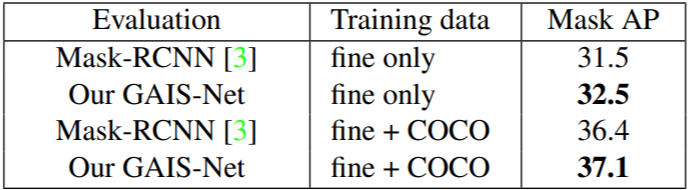

# GAIS-Net

GAIS-Net: Geometry-Aware Instance Segmentation with Disparity Maps

Wu, Cho-Ying and Hu, Xiaoyan and Happold, Michael and Xu, Qiangeng and Neumann, Ulrich, CVPR Workshop on Scalability in Autonomous Driving, 2020.

**Advantage:** 

**\+ The first work to directly regress instances from depth maps to advance the multi-modal learning for outdoor scenarios.**

**\+ High performance and highly modulized. The codes are based on the mask-rcnn benchmark framework.**

Please visit out [Project site](https://choyingw.github.io/works/GAIS-Net/index.html) for paper and intorduction.

This project is developed upon [Mask-RCNN](https://github.com/facebookresearch/maskrcnn-benchmark) and is done during an internship at [Argo AI](https://www.argo.ai/)

Feature: Resolve overlapping areas between instances by introducing geometry information

# Installation

Check [INSTALL.md](INSTALL.md) for installation instructions.

Note that cocoapi, cityscapesScripts, and apex are needed for the evaluation.

# Implementation

The geometry-aware fusion module is implemented under [roi_heads.py](maskrcnn_benchmark/modeling/roi_heads/roi_heads.py) [mask_head.py](maskrcnn_benchmark/modeling/roi_heads/mask_head/mask_head.py) [maskiou_head.py](maskrcnn_benchmark/modeling/roi_heads/maskiou_head/maskiou_head.py)

Check these files and related files for the features we implement.

# Data

1. The pre-generated stereo disparity maps by PSMNet for Cityscapes could be downloaded [here](https://drive.google.com/file/d/1yeDkcrl9t3QO0K2NQxfjxcHhtJR4hwYY/view?usp=sharing). Please first create folders "datasets/cityscapes" at the root of the repo and extract the zip file under datasets/cityscapes/

2. Go to [Cityscapes](https://www.cityscapes-dataset.com/) to download images of train/val set. Put the images under "datasets/cityscapes/train/image_2" and also "val". Download the annotations and put under datasets/cityscapes/annotations/

# Evaluation

NUM_GPUS=4 
python -m torch.distributed.launch --nproc_per_node=$NUM_GPUS ./tools/test_net.py --config-file "configs/cityscapes_v4.yaml" TEST.IMS_PER_BATCH 4

# Pretrain model

The pretrained weights could be downloaded [here](https://drive.google.com/file/d/1ZETFaG_xxw0NsX8S9Tj10Rp-XwQNsenf/view?usp=sharing) put the .pth file under "ckpt/"

# Results

# Citations

If you find the work useful, please condisder to cite:

	@inproceedings{wu2020Cvprw,
	title={Geometry-Aware Instance Segmentation with Disparity Maps},
	author={Wu, Cho-Ying and Hu, Xiaoyan and Happold, Michael and Xu, Qiangeng and Neumann, Ulrich},
	booktitle={CVPR Workshop on Scability in Autonomous Driving},
	year={2020}
	}

# Thanks to the Third Parties

Thank [Mask-RCNN](https://github.com/facebookresearch/maskrcnn-benchmark) and [Mask Scoring RCNN](https://github.com/zjhuang22/maskscoring_rcnn)
